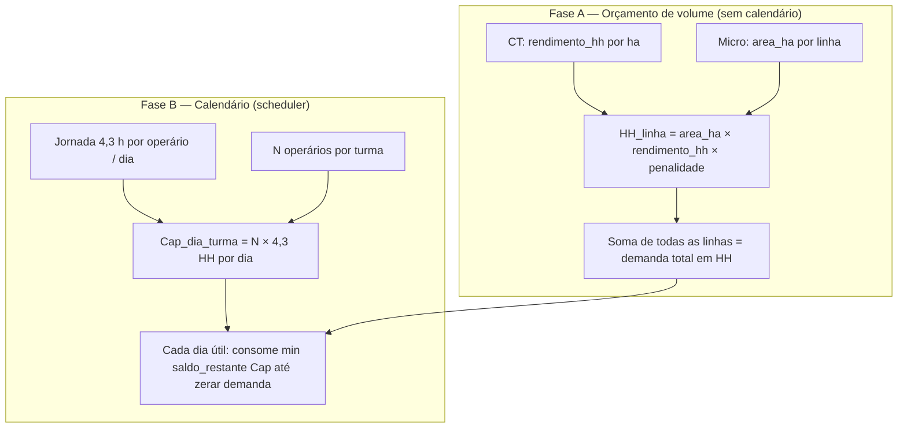

# Contas de horas-homem (HH) — de onde vêm os números

Este documento descreve **exatamente** como o SRF (`atm_v5.py`) calcula as **horas-homem** por atividade, **quais células da planilha CT** entram na conta e como isso chega ao microplanejamento (`exame.xlsx`). Serve para **conferência manual** linha a linha.

---

## 1. Fórmula usada no código

Para **cada linha** do microplanejamento (fazenda × talhão × atividade):

```
HH_linha = area_ha × rendimento_hh × penalidade
```

| Símbolo | Origem |
|--------|--------|
| `area_ha` | Coluna de área do micro (`exame.xlsx`, aba de microplanejamento). |
| `rendimento_hh` | Campo **`rendimento_hh`** da **tarifa CT** associada à atividade (ver §2–3). Unidade: **HH por hectare** (h/ha). |
| `penalidade` | No fluxo padrão do scheduler, **1,0**; só muda se o usuário aceitar penalidade por declividade no passo “Refinamento de declividade”. |

**Não há mediana nem “8 h/ha” inventado** quando `orcamento_estrito` está ativo e o `de_para` está preenchido: o rendimento vem da linha da CT ou a simulação para e pede correção.

Para atividades **mecanizadas** na CT (`tipo` contém “Mecanizada” ou `rendimento_hm > 0` com `rendimento_hh = 0`), o modelo de **mão de obra humana** usa **HH = 0** para o cronograma de pessoas; a **receita** ainda usa `preco_ha × area`. Horas de **máquina** (`rendimento_hm`) estão na CT mas **não** entram na soma de HH humano do simulador atual.

---

## 2. Cascata: HH/ha (orçamento) × área **não** mistura com 4,3 h (jornada)

### 2.0 O que cada número “quer dizer”

| Grandeza | Unidade | O que é |
|----------|---------|--------|
| **`rendimento_hh` (CT)** | **HH por hectare** (h/ha) | Orçamento: **quantas horas-homem no total** seriam gastas para **fazer 1 ha** daquele serviço, segundo a CT. **Não** é “horas por operário por dia”. |
| **`area_ha`** | hectare | Área da **linha** do micro (talhão × atividade). |
| **`HH_linha`** | horas-homem (HH) | **Volume de trabalho** daquela linha: `area_ha × rendimento_hh × penalidade`. É uma **soma contábil** de esforço, ainda **sem calendário**. |
| **`jornada` (ex.: 4,3)** | horas por **dia útil** por **um** operário | Só entra no **simulador de calendário**: quanto cada homem pode **fornecer** de HH por dia. |
| **Capacidade da turma num díá** | HH/dia | `operarios × jornada` (ex.: 5 pessoas × 4,3 h = **21,5 HH/dia** para essa turma). |

**Pergunta frequente:** “Se o orçamento é **10 HH/ha**, em algumas áreas a gente **gasta mais que 10** por hora de operário?”

- **Na conta de volume (orçamento):** não, **por hectare** você usa **exatamente** o `rendimento_hh` da CT (× penalidade, se houver). Para 1 ha são **10 HH**; para 6 ha são **60 HH** no total — são **60 horas-homem somadas** (podem ser 6 homens 10 h, ou 10 homens 6 h, etc.).
- **O 4,3 h** não multiplica nem divide o **10**. O 4,3 só diz **em quantos dias** esses 60 HH se espalham, **se** você tiver uma capacidade diária limitada.

Ou seja: **multiplicação** na fase orçamental = **área × HH/ha**. **“Divisão” do trabalho no tempo** = fase do **cronograma** (abaixo).

---

### 2.1 Cascata em camadas (duas fases separadas)



- **Fase A** não usa **4,3**. Só define **quanto trabalho existe** em HH.
- **Fase B** usa **4,3** e os **operários**: cada dia subtrai até **`cap_dia`** do saldo da fila (por turma, reforço, bloqueio, etc.).

No código, a Fase A está na construção de `demandas` / `demanda_global`; a Fase B está no `while dia` que faz `consumo = min(rest, cap_dia)` em `atm_v5.py`.

---

### 2.2 Exemplo numérico mínimo (para bater na calculadora)

**Dados:** uma única linha no micro — **6 ha** de adubação; CT diz **10,5 HH/ha**; penalidade **1,0**.

1. **Volume:** `HH_linha = 6 × 10,5 = 63` **HH** (trabalho total daquela linha).
2. **Não** fazemos `63 × 4,3` nem `10,5 ÷ 4,3` — isso misturaria unidades.
3. **Calendário:** suponha **3 operários** só nessa turma e **4,3 h/dia** → **cap_dia = 3 × 4,3 = 12,9 HH/dia**.
4. Dias **mínimos** só para essa linha, se fossem dedicados 100% a ela: `63 / 12,9 ≈ 4,88` → na prática **5 dias úteis** (o app vai consumindo pedaços de 12,9 até zerar os 63).

Se o orçamento fosse **10 HH/ha** em vez de 10,5: `6 × 10 = 60` HH; com a mesma turma, `60 / 12,9 ≈ 4,65` dias.

---

### 2.3 “Tomar mais que o orçamento” — quando isso acontece no app?

| Situação | Efeito no volume de HH |
|----------|------------------------|
| Só Fase A + CT | **Não** extrapola o `rendimento_hh` por ha (salvo **penalidade** 1,15 ou 1,30 se você ligar no menu). |
| **Penalidade de declividade** no app | Multiplica **HH/ha efetivo**: mesmo rendimento CT, fator ×1,15 ou ×1,30 sobre as horas. |
| **Trocar Classe I → V** no `de_para` | Aí sim muda o **rendimento_hh** da linha CT (mais HH/ha) — é outro orçamento, não “4,3”. |
| Scheduler | Só **distribui** os HH no tempo; **não** infla o total de HH por linha. |

---

### 2.4 Divisão do trabalho entre turmas (resumo)

- Cada **turma** tem sua **fila** (talhões e atividades que ela pode executar).
- Por **dia**, cada turma gasta no máximo **`operarios × jornada`** HH.
- O **saldo** `HH_linha` é **global** por par (talhão, atividade): várias turmas podem **parcelar** o mesmo serviço se estiverem **em paralelo**; **reforço** usa a folga do dia para consumir **outras** atividades não bloqueadas.
- Nenhuma dessas regras altera a definição `HH_linha = area × rendimento_hh × penalidade`; elas só decidem **quem** e **quando** cada HH é debitada.

---

## 3. De onde vem o `rendimento_hh` (tarifa CT)

### 3.1 Leitura da CT bruta (`CT_313_*.xlsm`)

A função `normalizar_ct313()` em `atm_v5.py`:

1. Localiza a aba cujo nome normalizado é **`Preco Final`** (sem acento, sem espaço).
2. Lê a aba **sem linha de cabeçalho único** (`header=None`) e percorre **a partir da linha índice 5** (sexta linha do Excel) em diante.
3. Para cada linha válida extrai:
   - **Coluna índice 2** → nome da atividade (chave da tarifa no `config.json`).
   - **Coluna índice 4** → `tipo` (Manual, Semi-Mecanizada, Mecanizada, …).
   - **Coluna índice 5** → **`rendimento_hh`** (HH/ha na proposta de preços).
   - **Coluna índice 6** → **`rendimento_hm`** (HM/ha, mecanizado).
   - **Coluna índice 7** → **`preco_ha`** (R$/ha).

Trecho de referência no código:

```344:374:e:\cli_planilhas\atm_v5.py
    rows = []
    for i in range(5, len(df)):
        r = df.iloc[i]
        nome = str(r[2]).strip() if pd.notna(r[2]) else ""
        ...
        tipo = str(r[4]).strip() if pd.notna(r[4]) else ""
        ...
            hh = float(r[5]) if pd.notna(r[5]) else 0.0
        ...
            hm = float(r[6]) if pd.notna(r[6]) else 0.0
        ...
            preco = float(r[7]) if pd.notna(r[7]) else 0.0
```

1. Grava isso em **`CT_313_NORMALIZADA.xlsx`**, aba **`STG_TARIFAS`**, e o bootstrap carrega em **`config.json` → `tarifas`**.

### 3.2 Custo hora TF (contexto, não entra no HH)

Na mesma normalização, a aba **`Diaria_TF`** (nome contendo `diaria_tf`) fornece `custo_hora_tf` para custo de MO **quando** há HH > 0; isso **não altera** o cálculo de **volume** de HH, só o **valor** em R$.

---

## 4. Ligação microplanejamento → tarifa (`de_para`)

O nome da atividade no **micro** (texto longo, com “Impl.”, barras, etc.) **não** é igual ao nome curto na CT.

O app:

1. Normaliza com **`normalizar_chave()`**: remove acentos, tira pontuação (`/`, `.`, `-`), colapsa espaços.
2. Consulta o mapa fixo **`DEFAULT_DEPARA_EXAME_CT313`** em `atm_v5.py` (protótipo **EXAME → CT**).
3. Grava o par em **`config.json` → `de_para`**: `[texto exato no micro] → [nome exato da tarifa em tarifas]`.

Assim, para cada atividade do micro:

```
chave_tarifa = de_para.get(atividade_micro, atividade_micro)
rendimento_hh = tarifas[chave_tarifa]["rendimento_hh"]
```

Se a chave não existir em `tarifas`, com orçamento estrito o fluxo exige correção (não usa mediana silenciosa).

---

## 5. Área usada na “conta por atividade” (tabela abaixo)

Para **conferir por nome de atividade no micro**, a tabela seguinte usa a **soma das áreas (ha)** de **todas as fazendas e talhões** do `exame.xlsx` onde essa atividade aparece — ou seja, o **volume total de obra** da base de teste para aquela linha de atividade.

Fórmula por linha da tabela:

```
HH_total_atividade = area_ha_total × rendimento_hh
```

(Equivalente a somar `area_ha × rendimento_hh` em cada linha do micro para aquela atividade, com `penalidade = 1`.)

---

## 6. Tabela de contas (base atual: `exame.xlsx` + `config.json` tarifas)

Valores numéricos gerados a partir do mesmo pipeline do app (de_para + tarifas). Pequenas diferenças de arredondamento em centésimos são normais.

| Atividade no micro (como no Excel) | Área total (ha) | Chave na CT (`tarifas`) | HH/ha (CT) | HM/ha (CT) | Tipo (CT) | HH total (= área × HH/ha) |
|-----------------------------------|-----------------|-------------------------|------------|------------|-----------|---------------------------|
| ADUBAÇÃO QUÍM MAN DE BASE Impl. PL - APP/ RL | 107,506 | ADUBAÇÃO QUÍMICA MANUAL | 10,5 | 0 | Manual | 1.128,81 |
| CAPINA MANUAL COROA Impl. CD APP/ RL I | 48,665 | CAPINA COROAMENTO MANUAL I | 12,0 | 0 | Manual | 583,98 |
| CAPINA MANUAL COROA Impl. PL - APP/ RL I | 126,340 | CAPINA COROAMENTO MANUAL I | 12,0 | 0 | Manual | 1.516,08 |
| CAPINA QUÍM MAN TOTAL Manut. APP/RL | 0,273 | CAPINA QUÍMICA TOTAL MANUAL PLANO | 7,5 | 0 | Manual | 2,05 |
| COMBATE À FORMIGAS Impl. CD APP/RL | 53,585 | COMBATE DE FORMIGAS MANUAL | 2,5 | 0 | Manual | 133,96 |
| COMBATE À FORMIGAS Impl. PL APP/ RL | 166,081 | COMBATE DE FORMIGAS MANUAL | 2,5 | 0 | Manual | 415,20 |
| COMBATE À FORMIGAS Manut. APP/RL | 0,738 | CONTROLE DE FORMIGAS MANUAL (REPASSE) | 1,8 | 0 | Manual | 1,33 |
| CONDUÇÃO DE REGENERAÇÃO | 53,585 | SERVIÇO DE MÃO DE OBRA | 7,488* | 0 | Manual | 401,24 |
| CONTROLE DE INVASORAS APP/RL I | 1,070 | CAPINA QUÍMICA TOTAL MANUAL PLANO | 7,5 | 0 | Manual | 8,03 |
| COVEAMENTO - MOTOCOVEADOR PL APP/RL | 74,347 | COVEAMENTO SEMI MECANIZADO - 30CM | 35,5 | 0 | Semi-Mecanizada | 2.639,31 |
| COVEAMENTO ÁREA SUBSOL Impl. PL - APP/RL | 9,902 | SUBSOLAGEM COM ADUBAÇÃO (TRATOR PNEU) | 0 | 1,2 | Mecanizada | **0,00** |
| ELIMINAÇÃO DE EXÓTICAS Impl. CD - APP/RL | 0,428 | SERVIÇO DE MÃO DE OBRA | 7,488* | 0 | Manual | 3,20 |
| IRRIGAÇÃO INICIAL MAN Impl. PL - APP/ RL | 107,506 | IRRIGAÇÃO DE PLANTIO MANUAL | 12,5 | 0 | Manual | 1.343,82 |
| LIMPEZA DE AREA QUIM. Impl. CD APP/RL | 48,665 | ROÇADA SEMIMECANIZADA ÁREA TOTAL | 22,0 | 0 | Semi-Mecanizada | 1.070,63 |
| LIMPEZA DE ÁREA QUIM. MAN APP/RL | 126,340 | ROÇADA MANUAL CLASSE I | 12,0 | 0 | Manual | 1.516,08 |
| NUCLEAÇÃO EM FAIXAS APP/RL | 39,609 | SERVIÇO DE MÃO DE OBRA | 7,488* | 0 | Manual | 296,59 |
| PLANTIO MANUAL APP/RL | 67,897 | PLANTIO MANUAL SEM GEL | 7,0 | 0 | Manual | 475,28 |
| PREPARO DE SOLO MEC C/ GRADE APP/RL | 2,110 | PREPARO DE SOLO COM ADUBAÇÃO DE BASE E MARCAÇÃO DE BACIA ECAVADEIRA | 0 | 7,5 | Mecanizada | **0,00** |
| PREPARO DE SOLO MEC S/ ADUB APP/RL | 21,148 | PREPARO DE SOLO COM MÁQUINA DE ESTEIRA | 0 | 1,35** | Mecanizada | **0,00** |
| ROÇADA MANUAL Impl. CD APP/RL I | 48,665 | ROÇADA MANUAL CLASSE I | 12,0 | 0 | Manual | 583,98 |
| ROÇADA MANUAL Impl. PL APP/RL I | 126,340 | ROÇADA MANUAL CLASSE I | 12,0 | 0 | Manual | 1.516,08 |

\* Na CT, “SERVIÇO DE MÃO DE OBRA” pode aparecer com rendimento com mais casas decimais; o valor em `tarifas` é o que foi importado da última normalização.

\** O valor de **HM/ha** na sua STG pode ser 1,35 ou 1,40 conforme a linha exata da aba **Preço Final** no momento da última geração — conferir em `CT_313_NORMALIZADA.xlsx` / CT bruta.

**Soma dos HH humanos (última coluna):** **≈ 13.635,7 HH** (coincide com a soma no pipeline do app para a base inteira do `exame.xlsx`).

---

## 7. Como conferir manualmente (checklist)

1. Abrir a **CT bruta** → aba **Preço Final**.
2. Achar a **linha** do serviço com o mesmo **nome** da coluna “Chave na CT” da tabela acima (coluna de descrição da atividade na planilha de preço).
3. Conferir na mesma linha o valor de **HH/ha** (coluna correspondente ao índice **5** na leitura programática — no Excel visual, é a coluna **F** se a primeira coluna for A e a contagem bater com o layout atual da CT).
4. Abrir o **micro** → localizar a atividade pelo texto exato da primeira coluna da tabela.
5. Somar **áreas (ha)** de todas as linhas com essa atividade (ou filtrar por fazenda, se quiser conferir só uma fazenda).
6. Calcular: **soma(áreas) × HH/ha** = HH total esperado para aquela atividade (com penalidade 1).

Se o passo 6 não bater com o app, os pontos típicos de divergência são: **de_para errado**, **tarifas desatualizadas** (CT reimportada sem salvar), ou **penalidade ≠ 1** no scheduler.

---

## 8. Resumo em uma frase

**Volume (HH):** (área no micro) × (HH/ha da CT, via `de_para`) × penalidade opcional. **Jornada 4,3 h:** só define **ritmo diário** no scheduler (`operarios × jornada` HH/dia); **não** entra na multiplicação do orçamento por hectare.

---

*Documento alinhado à lógica de `atm_v5.py` (normalização CT, `carregar_stg_tarifas`, `resolver_rendimento_hh`, construção de demandas em `calcular_cronograma_inteligente`).*

---

## Exemplo auditável (uma fazenda)

Ver **`CONTAS_EXEMPLO_FORMOSA.md`** — extração completa FORMOSA (`FORMOSA_extracao_micro.csv`), política **Classe I (plano)** vs **V (declive)**, e contas com **9 executores × 4,3 h**.
